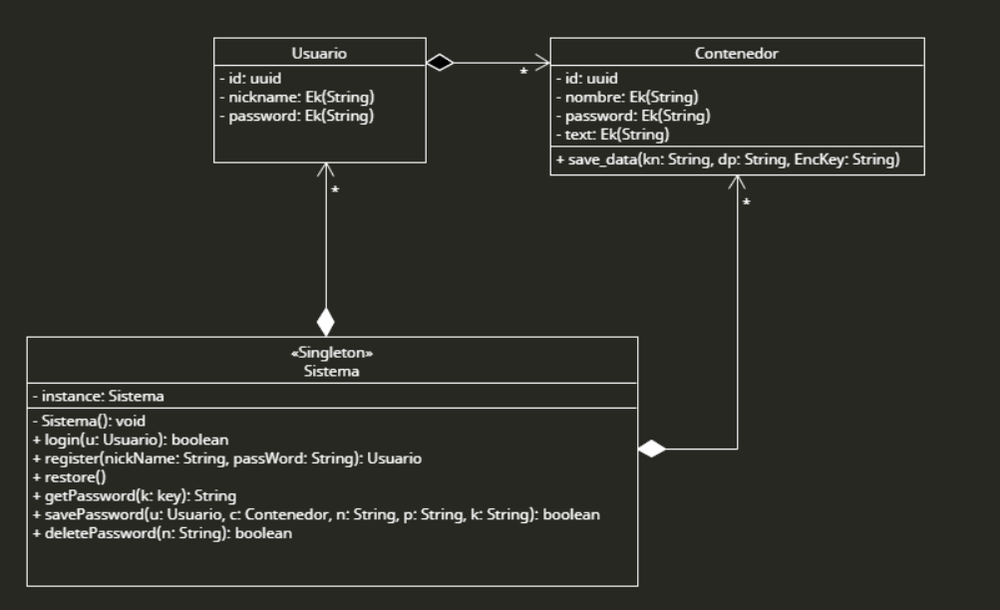

# SecureBox

Un gestor de contraseñas y datos sensibles desarrollado en Python con interfaz gráfica (Tkinter) y de línea de comandos (CLI), que utiliza cifrado AES-128 en modo GCM y verificación de integridad mediante checksums en Google Drive.

## 📋 Descripción

SecureBox es una aplicación de escritorio para el almacenamiento seguro de información sensible organizada en "contenedores" cifrados. Cada usuario puede crear múltiples contenedores protegidos con contraseñas individuales, donde almacenar texto cifrado (contraseñas, notas, claves API, etc.). La aplicación implementa las mejores prácticas de criptografía moderna y un sistema robusto de verificación de integridad:

- **Cifrado AES-128 en modo GCM** (Galois/Counter Mode) para autenticación y confidencialidad
- **Derivación de claves con PBKDF2** (100,000 iteraciones) para resistir ataques de fuerza bruta
- **Salt único por usuario y contenedor** para prevenir ataques de diccionario y rainbow tables
- **Autenticación mediante SHA-256** para verificar credenciales sin almacenar contraseñas
- **Ofuscación XOR del salt** como capa adicional de seguridad
- **Verificación de integridad** con checksums SHA-256 almacenados en Google Drive
- **Backups automáticos** en Google Drive con marca temporal
- **Doble interfaz**: GUI intuitiva con Tkinter y CLI completa
- **Protección contra fuerza bruta**: Auto-destrucción de la base de datos tras 10 intentos fallidos

## 🔒 Arquitectura de Seguridad

### Sistema de Autenticación Multi-Capa

#### 1. Autenticación de Usuario

```
Contraseña del Usuario
        ↓
Salt único (16 bytes) generado con os.urandom(16)
        ↓
SHA-256(salt + contraseña)
        ↓
Hash almacenado en base de datos
        ↓
Comparación para autenticación
```

#### 2. Protección del Salt mediante XOR

Una característica única de SecureBox es la ofuscación del salt:

```
Salt original (A) ← os.urandom(16)
Número aleatorio (B) ← os.urandom(16)
        ↓
C = A ⊕ B  (operación XOR)
        ↓
Almacenar: C || B (concatenación)
        ↓
Para recuperar: A = C ⊕ B
```

Esto añade una capa adicional de seguridad, ya que el salt no se almacena directamente en la base de datos.

#### 3. Derivación de Claves

```
Contraseña + Salt
        ↓
PBKDF2-HMAC-SHA256
  - 100,000 iteraciones
  - dkLen = 32 bytes (256 bits)
        ↓
Clave Derivada (usada para cifrado AES)
```

#### 4. Cifrado de Contenedores

```
Datos en claro
        ↓
AES-128-GCM
  - Clave: Clave derivada
  - Nonce: 12 bytes aleatorios
        ↓
Ciphertext + Tag (16 bytes)
        ↓
Almacenar: Nonce (12) || Ciphertext || Tag (16)
```

**Ventajas del modo GCM:**
- Autenticación integrada (detecta manipulación)
- Confidencialidad garantizada
- Rendimiento eficiente

### Sistema de Verificación de Integridad

```
┌─────────────────────────────────────────────────────────┐
│                    AL INICIAR                           │
└─────────────────────────────────────────────────────────┘
                         │
                         ↓
         ¿Verificar integridad? ◄─── Pregunta al usuario
                         │
                    ┌────┴────┐
                    │   SÍ    │
                    └────┬────┘
                         ↓
            Autenticar con Google OAuth
                         ↓
            Descargar último checksum de Drive
                         ↓
            Calcular SHA-256 de secure_box.db
                         ↓
                   Comparar ambos
                         │
          ┌──────────────┼──────────────┐
          │                             │
    ✅ COINCIDEN                  ❌ NO COINCIDEN
          │                             │
  Base de datos íntegra      ⚠️ Posible corrupción/manipulación
          │                   Sugerencia: Restaurar backup
          └──────────────┬──────────────┘
                         │
                  Continuar ejecución

┌─────────────────────────────────────────────────────────┐
│                    AL CERRAR                            │
└─────────────────────────────────────────────────────────┘
                         │
                         ↓
       ¿Crear backup? ◄─── Pregunta al usuario
                         │
                    ┌────┴────┐
                    │   SÍ    │
                    └────┬────┘
                         ↓
            Autenticar con Google OAuth
                         ↓
        Calcular SHA-256 de secure_box.db actual
                         ↓
   Subir checksum: [timestamp]_checksum.txt
                         ↓
   Subir backup: [timestamp]_secure_box_backup.db
                         ↓
                Cerrar aplicación
```

## 🚀 Características

### Gestión de Usuarios
- ✅ Registro de nuevos usuarios con validación
- ✅ Inicio de sesión seguro con hash SHA-256
- ✅ Sistema de rating/puntuación por usuario
- ✅ Protección contra fuerza bruta (10 intentos máximos)

### Gestión de Contenedores
- ✅ Creación de múltiples contenedores por usuario
- ✅ Cada contenedor con contraseña independiente
- ✅ Almacenamiento de texto cifrado en cada contenedor
- ✅ Visualización segura del contenido
- ✅ Edición con cifrado automático
- ✅ Eliminación segura de contenedores

### Interfaz de Usuario
- ✅ **GUI con Tkinter**: Interfaz gráfica intuitiva y amigable
  - Login/Registro visual
  - Lista de contenedores en TreeView
  - Panel deslizante para edición
  - Modales para operaciones seguras
- ✅ **CLI completa**: Terminal interactiva con curses
  - Editor de texto integrado en terminal
  - Navegación con flechas
  - Todos los comandos disponibles

### Seguridad y Backup
- ✅ **Verificación de integridad** al iniciar (opcional)
- ✅ **Backups automáticos** en Google Drive al cerrar (opcional)
- ✅ **Checksums SHA-256** para detectar manipulación
- ✅ **Restauración** desde Google Drive
- ✅ **Sincronización** con marca temporal
- ✅ **Auto-destrucción** tras múltiples intentos fallidos

## 🛠️ Tecnologías

- **Python 3.8+**
- **Tkinter** - Interfaz gráfica
- **curses** - Interfaz de terminal avanzada
- **pycryptodome** - Cifrado AES-GCM, PBKDF2, SHA-256
- **SQLite3** - Base de datos local
- **PyDrive2** - Integración con Google Drive API
- **uuid** - Generación de identificadores únicos

## 📦 Instalación

### Requisitos previos
- Python 3.8 o superior
- pip (gestor de paquetes de Python)
- Cuenta de Google (para backups y verificación de integridad)

### Instalación de dependencias

```bash
# Clonar el repositorio
git clone https://github.com/RolingsonJohn/SecureBox.git
cd SecureBox

# Crear entorno virtual (recomendado)
python -m venv venv
source venv/bin/activate  # En Windows: venv\Scripts\activate

# Instalar dependencias
sudo apt install python3-tk
pip install -r requirements.txt
```

### Creación de la Base de Datos

```bash
# Ejecutar el script de creación (solo primera vez)
python CreateDataBase.py
```

Esto creará el archivo `secure_box.db` con las siguientes tablas:

**Tabla Usuario:**
```sql
CREATE TABLE Usuario (
    UserId VARCHAR(32) NOT NULL PRIMARY KEY,  -- UUID único
    Nickname BLOB UNIQUE,                      -- Hash SHA-256 del nickname
    Password BLOB,                             -- Hash SHA-256(salt + password)
    Email BLOB,                                -- Salt ofuscado (C || B)
    Phone BLOB,                                -- Datos adicionales
    Image BLOB                                 -- Datos adicionales
)
```

**Tabla Contenedor:**
```sql
CREATE TABLE Contenedor (
    ContainerId VARCHAR(32) NOT NULL PRIMARY KEY,  -- UUID único
    UserId VARCHAR(32),                            -- FK a Usuario
    Name BLOB UNIQUE,                              -- Nombre cifrado
    Password BLOB,                                 -- Hash cifrado de la contraseña
    Text BLOB,                                     -- Contenido cifrado
    Image BLOB,                                    -- Salt ofuscado
    NumKeys BLOB,                                  -- Metadatos
    FOREIGN KEY (UserId) REFERENCES Usuario(UserId)
)
```

## 🔐 Detalles de Implementación

### Clase Sistema (Singleton)

```python
class Sistema:
    _instance = None  # Singleton pattern
    
    def register(nickname, password)
    def login(nickname, password) -> TypeRet
    def save_data(bk: bool)
    def save_backup(drive)
    def restore_database()
    def pull_checksum() -> bool
    def push_checksum(drive)
```

### Clase Usuario

```python
class Usuario:
    def __init__(id, name, password, nonce, salt)
    def add_container(name, cont_password)
    def delete_container(name, cont_password) -> bool
    def load_containers(password)
```

### Clase Contenedor

```python
class Contenedor:
    def __init__(id, name, hashed_password, cif_text, salt)
    def check_password(password) -> bool
    def descif_data(password) -> str
    def touch_data(password, data_to_keep) -> bool
```

### Funciones de Utilidad (utils.py)

```python
def xor_operation(a: bytes, b: bytes, size: int) -> bytes
def encryption(mensaje: str, key: bytes) -> bytes
def decryption(cif_data: bytes, key: bytes) -> bytes
def derivate_key(password: str, salt: bytes) -> bytes
```

### Códigos de Retorno (TypeRet)

```python
class TypeRet(Enum):
    OK = 0           # Operación exitosa
    FAILED = -1      # Operación fallida
    HACKING = -200   # Múltiples intentos fallidos (auto-destrucción)
    NO_DB = -2       # Base de datos no encontrada
    REP = -3         # Datos duplicados (IntegrityError)
```

## 🎨 Diagrama de Clases



## ⚠️ Consideraciones y Limitaciones

### Seguridad

- **Contraseña Maestra**: La seguridad total depende de su fortaleza
- **No hay recuperación**: Si olvidas tu contraseña maestra, pierdes acceso permanente
- **Base de datos local**: Se almacena sin cifrado de disco completo
- **Backups en Drive**: Dependen de la seguridad de tu cuenta Google
- **Auto-destrucción**: Tras 10 intentos fallidos, la BD se elimina automáticamente

### Almacenamiento

- **No sincronización multi-dispositivo**: Diseñado para uso en un solo equipo
- **Límites de Drive**: Sujeto a cuotas de almacenamiento de Google

## 👨‍💻 Autores

**John Ander Rolingson Avellanal**
- GitHub: [@RolingsonJohn](https://github.com/RolingsonJohn)
**Diego Núñez García**
- GitHub: [@Dgo089](https://github.com/Dgo089)

---

**Nota Final**: SecureBox es un proyecto educativo que demuestra conceptos de criptografía y gestión segura de datos. Aunque implementa medidas de seguridad sólidas, para uso profesional o empresarial se recomienda utilizar soluciones comerciales auditadas por expertos en seguridad independientes.